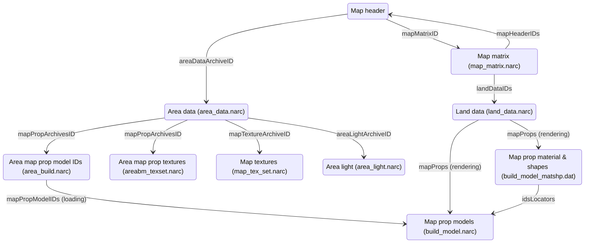

# Map file format specifications

The following sections describe the various file formats encountered in the files
containing map data.

Values and offsets described in this document are those found in the vanilla ROM
of Pokémon Platinum.

Here's a graph representing the different files and how they point to data in
other files:



As you can see, most of those files are NARC files.

The following types are considered well-known and used throughout this document:

- `u8`/`u16`/`u32`: unsigned 8/16/32-bit integers.
- `bool`: unsigned 8-bit integer, where 0 is `false` and 1 is `true`.
- `char`: unsigned 8-bit integer representing a character.
- `fx32`: signed 32-bit fixed-point number, with 1 bit for the sign, 19 bits
  for the integer part, and 12 bits for the fractional part (1.19.12).
- `VecFx32`: structure containing three `fx32` values, representing a 3D vector.

Moreover, for any type `T`, `T[]` represents an array of `T`. Any other type
should be documented in the context where it is used.

## Map headers

The map headers are not stored in a file on the ROM, but are instead hard-coded
in the game's code. Because of it is the starting point for loading a map, it
is nevertheless included in this list.

A map header is a structure that contains metadata about a map:

```c
struct MapHeader {
    u8 areaDataArchiveID;
    u8 unk_01;
    u16 mapMatrixID;
    u16 scriptsArchiveID;
    u16 initScriptsArchiveID;
    u16 msgArchiveID;
    u16 dayMusicID;
    u16 nightMusicID;
    u16 wildEncountersArchiveID;
    u16 eventsArchiveID;
    u16 mapLabelTextID : 8;
    u16 mapLabelWindowID : 8;
    u8 weather;
    u8 cameraType;
    u16 mapType : 7;
    u16 battleBG : 5;
    u16 isBikeAllowed : 1;
    u16 isRunningAllowed : 1;
    u16 isEscapeRopeAllowed : 1;
    u16 isFlyAllowed : 1;
};
```

## Map matrix (`map_matrix.narc`)

This file contains 289 files.

Here's the structure of each file:

| Name                     | Offset                                               | Size                                                              | Type     | Description                                                                                                                                                                                    |
| ------------------------ | ---------------------------------------------------- | ----------------------------------------------------------------- | -------- | ---------------------------------------------------------------------------------------------------------------------------------------------------------------------------------------------- |
| `height`                 | `0x0000`                                             | 1                                                                 | `u8`     | Height of the map matrix (how many maps are in the vertical direction).                                                                                                                        |
| `width`                  | `0x0001`                                             | 1                                                                 | `u8`     | Width of the map matrix (how many maps are in the horizontal direction).                                                                                                                       |
| `hasMapHeaderIDsSection` | `0x0002`                                             | 1                                                                 | `bool`   | Whether the map matrix contains the map header IDs section ("`mapHeadersIDs`").                                                                                                                |
| `hasAltitudesSection`    | `0x0003`                                             | 1                                                                 | `bool`   | Whether the map matrix contains the altitudes section ("`altitudes`").                                                                                                                         |
| `modelNamePrefixLen`     | `0x0004`                                             | 1                                                                 | `u8`     | Length of the model name prefix string ("`modelNamePrefix`")                                                                                                                                   |
| `modelNamePrefix`        | `0x0005`                                             | `modelNamePrefixLen`                                              | `char[]` | Prefix given to the map model names found in the NSBMD files.                                                                                                                                  |
| `mapHeaderIDs`           | `0x0006`                                             | 2 \* `height` \* `width` if `hasMapHeaderIDsSection == 1`, else 0 | `u16[]`  | 2D array of map header IDs. The IDs are stored in row-major order. Not present if `hasMapHeaderIDsSection` is set to `0`.                                                                      |
| `altitudes`              | `0x0006 + sizeof(mapHeadersIDs)`                     | `height` \* `width` if `hasAltitudesSection == 1`, else 0         | `u8[]`   | 2D array of altitudes. Used to calculate the Y coordinate when rendering a map and its props. The altitudes are stored in row-major order. Not present if `hasAltitudesSection` is set to `0`. |
| `landDataIDs`            | `0x0006 + sizeof(mapHeadersIDs) + sizeof(altitudes)` | 2 \* `height` \* `width`                                          | `u16[]`  | 2D array of indexes in the `land_data.narc` NARC. The indexes are stored in row-major order.                                                                                                   |

> [!NOTE]
> The same index in `mapHeadersIDs`, `altitudes`, and `landDataIDs` refers to the same map.

## Land data (`land_data.narc`)

This NARC contains 666 files.

Here's the structure of each file:

| Name                    | Offset                                 | Size                                           | Type               | Description                                                                                                                       |
| ----------------------- | -------------------------------------- | ---------------------------------------------- | ------------------ | --------------------------------------------------------------------------------------------------------------------------------- |
| `terrainAttributesSize` | `0x0000`                               | 4                                              | `u32`              | Size of the terrain attributes section ("`terrainAttributes`"). Always set to, and expected to be set to 2048.                    |
| `mapPropsSize`          | `0x0004`                               | 4                                              | `u32`              | Size of the map props section ("`mapProps`").                                                                                     |
| `mapModelSize`          | `0x0008`                               | 4                                              | `u32`              | Size of the map model section ("`mapModel`").                                                                                     |
| `bdhcSize`              | `0x000C`                               | 4                                              | `u32`              | Size of the BDHC section ("`bdhc`").                                                                                              |
| `terrainAttributes`     | `0x0010`                               | `terrainAttributesSize` (2 \* 32 \* 32 = 2048) | `u16[]`            | 2D array (32x32) of terrain attributes, which contains tile collision and behavior. The attributes are stored in row-major order. |
| `mapProps`              | `0x0810`                               | `mapPropsSize`                                 | Struct `MapProp[]` | Array of map props placed on the map. There can be at most 32 map props per map.                                                  |
| `mapModel`              | `0x0810 + mapPropsSize`                | `mapModelSize`                                 | NSBMD              | The model file for the map.                                                                                                       |
| `bdhc`                  | `0x0810 + mapPropsSize + mapModelSize` | `bdhcSize`                                     | Struct `BDHC`      | BDHC data for the map.                                                                                                            |

### Struct `MapProp`

| Name       | Offset   | Size | Type      | Description                                                        |
| ---------- | -------- | ---- | --------- | ------------------------------------------------------------------ |
| `modelID`  | `0x0000` | 2    | `u16`     | Index of the associated model in the `build_model.narc` NARC.      |
| `position` | `0x0002` | 12   | `VecFx32` | Position of the map prop on the map.                               |
| `rotation` | `0x000E` | 12   | `VecFx32` | Rotation of the map prop, where each angle is between 0 and 65535. |
| `scale`    | `0x001A` | 12   | `VecFx32` | Scale of the map prop, where 1.0 is the original size.             |
| `dummy`    | `0x0026` | 8    | `u32[2]`  | Unknown: unused in the code, and seems to be always zero.          |

### Struct `BDHC`

| Name              | Offset                     | Size                   | Type                 | Description                                                                                                                       |
| ----------------- | -------------------------- | ---------------------- | -------------------- | --------------------------------------------------------------------------------------------------------------------------------- |
| `magic`           | `0x0000`                   | 4                      | `char[]`             | Magic number: always set to `BDHC`.                                                                                               |
| `pointsCount`     | `0x0004`                   | 2                      | `u16`                | Number of elements in the points array ("`points`").                                                                              |
| `slopesCount`     | `0x0006`                   | 2                      | `u16`                | Number of elements in the slopes array ("`slopes`").                                                                              |
| `heightsCount`    | `0x0008`                   | 2                      | `u16`                | Number of elements in the heights array ("`heights`").                                                                            |
| `platesCount`     | `0x000A`                   | 2                      | `u16`                | Number of elements in the plates array ("`plates`").                                                                              |
| `stripsCount`     | `0x000C`                   | 2                      | `u16`                | Number of elements in the strips array ("`strips`").                                                                              |
| `accessListCount` | `0x000E`                   | 2                      | `u16`                | Number of elements in the access list array ("`accessList`").                                                                     |
| `points`          | `0x0010`                   | 8 \* `pointsCount`     | Struct `BDHCPoint[]` | Array of 2D points.                                                                                                               |
| `slopes`          | `0x0010 + 8 * pointsCount` | 12 \* `slopesCount`    | `VecFx32[]`          | Array of slopes. They represent the normal vector of a BDHC plate (e.g., for a horizontal plate, the vector that points upwards). |
| `heights`         | `... + 12 * slopesCount`   | 4 \* `heightsCount`    | `fx32[]`             | Array of heights. They represent the base height of a plate.                                                                      |
| `plates`          | `... + 4 * heightsCount`   | 8 \* `platesCount`     | Struct `BDHCPlate[]` | Array of plates.                                                                                                                  |
| `strips`          | `... + 8 * platesCount`    | 8 \* `stripsCount`     | Struct `BDHCStrip[]` | Array of strips, which are groups of plates.                                                                                      |
| `accessList`      | `... + 8 * stripsCount`    | 2 \* `accessListCount` | `u16[]`              | Array of indexes in the `plates` array.                                                                                           |

#### Struct `BDHCPoint`

| Name | Offset   | Size | Type   | Description                |
| ---- | -------- | ---- | ------ | -------------------------- |
| `x`  | `0x0000` | 4    | `fx32` | X coordinate of the point. |
| `y`  | `0x0004` | 4    | `fx32` | Y coordinate of the point. |

> [!NOTE]
> The BDHC coordinate system is a 2D grid where the origin is at the center of
> the map, the X axis points to the right, and the Y axis points downwards.
>
> The top-left corner of the map is at (-16, -16), and the bottom-right corner
> is at (16, 16).

#### Struct `BDHCPlate`

| Name               | Offset   | Size | Type  | Description                                                     |
| ------------------ | -------- | ---- | ----- | --------------------------------------------------------------- |
| `firstPointIndex`  | `0x0000` | 2    | `u16` | Index of the first (top-left) point in the `points` array.      |
| `secondPointIndex` | `0x0002` | 2    | `u16` | Index of the second (bottom-right) point in the `points` array. |
| `slopeIndex`       | `0x0004` | 2    | `u16` | Index of the slope in the `slopes` array.                       |
| `heightIndex`      | `0x0006` | 2    | `u16` | Index of the height in the `heights` array.                     |

#### Struct `BDHCStrip`

| Name                     | Offset   | Size | Type   | Description                                                                                                                                                                                                                                    |
| ------------------------ | -------- | ---- | ------ | ---------------------------------------------------------------------------------------------------------------------------------------------------------------------------------------------------------------------------------------------- |
| `lowerBound`             | `0x0000` | 4    | `fx32` | The lower bound of the strip, which represents the highest Y coordinate among all the second points of the plates within the strip. In other words, this is the bottom coordinate of the strip. It is sometimes off by 1, for unknown reasons. |
| `accessListElementCount` | `0x0004` | 2    | `u16`  | Number of elements in the access list for this strip.                                                                                                                                                                                          |
| `accessListStartIndex`   | `0x0006` | 2    | `u16`  | Index of the first element in the access list for this strip.                                                                                                                                                                                  |

## Area data (`area_data.narc`)

This NARC contains 75 files.

Here's the structure of each file:

| Name                  | Offset   | Size | Type  | Description                                                                            |
| --------------------- | -------- | ---- | ----- | -------------------------------------------------------------------------------------- |
| `mapPropArchivesID`   | `0x0000` | 2    | `u16` | Index of the associated files in the `area_build.narc` and `areabm_texset.narc` NARCs. |
| `mapTextureArchiveID` | `0x0002` | 2    | `u16` | Index of the associated file in the `map_tex_set.narc` NARC.                           |
| `dummy`               | `0x0004` | 2    | `u16` | Unknown: value changes in the NARC, but is unused in the code.                         |
| `areaLightArchiveID`  | `0x0006` | 2    | `u16` | Index of the associated file in the `area_light.narc` NARC.                            |

## Area map prop model IDs (`area_build.narc`)

## Area map prop textures (`areabm_texset.narc`)

## Area light (`area_light.narc`)

## Map textures (`map_tex_set.narc`)

## Map prop models (`build_model.narc`)

## Map prop material & shapes (`build_model_matshp.dat`)

This file is _not_ a NARC file, but a binary file containing the material and
shape (mesh) IDs for each map prop model.

| Name               | Offset   | Size                    | Type                                    | Description                                         | Value                             |
| ------------------ | -------- | ----------------------- | --------------------------------------- | --------------------------------------------------- | --------------------------------- |
| `idsLocatorsCount` | `0x0000` | 2                       | `u16`                                   | Number of material & shape ID locators in the file. | 590 (one for each map prop model) |
| `idsCount`         | `0x0002` | 2                       | `u16`                                   | Number of material & shape IDs in the file.         | 1009                              |
| `idsLocators`      | `0x0004` | 4 \* `idsLocatorsCount` | Struct `MapPropMaterialShapeIDsLocator` | Array of material & shape ID locators.              |                                   |
| `ids`              | `0x093C` | 4 \* `idsCount`         | Struct `MapPropMaterialShapeIDs`        | Array of material & shape IDs.                      |                                   |

### Struct `MapPropMaterialShapeIDsLocator`

| Name       | Offset   | Size | Type  | Description                                                                                     |
| ---------- | -------- | ---- | ----- | ----------------------------------------------------------------------------------------------- |
| `idsCount` | `0x0000` | 2    | `u16` | Number of elements in the material & shape IDs array ("`ids`") for this map prop model.         |
| `idsIndex` | `0x0002` | 2    | `u16` | Index of the first element in the material & shape IDs array ("`ids`") for this map prop model. |

### Struct `MapPropMaterialShapeIDs`

| Name         | Offset   | Size | Type  | Description  |
| ------------ | -------- | ---- | ----- | ------------ |
| `materialID` | `0x0000` | 2    | `u16` | Material ID. |
| `shapeID`    | `0x0002` | 2    | `u16` | Shape ID.    |
